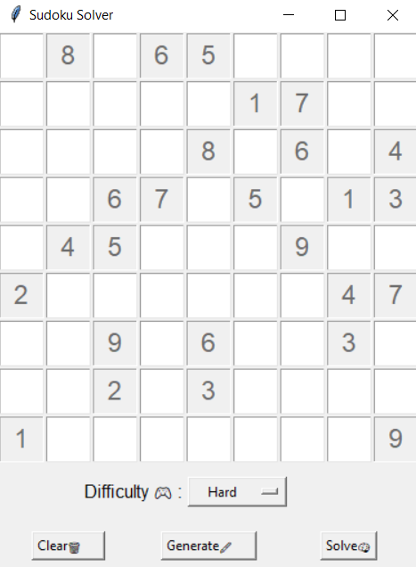

# 🧩 Sudoku Solver - SAT Powered

 <!-- Remplace ce chemin par ton image -->

## 📝 Description

Un solveur de Sudoku intelligent utilisant un **SAT solver** (pycosat) pour résoudre les grilles de sudoku avec **interface graphique Tkinter**.  
Il peut également générer des grilles jouables selon différents niveaux de difficulté (Easy, Medium, Hard).

---

## 🚀 Fonctionnalités

- Résolution automatique de grilles de Sudoku (via pycosat)
- Génération de grilles jouables selon la difficulté
- Détection de solution unique
- Interface graphique intuitive avec **Tkinter**
- Option pour effacer, générer ou résoudre une grille
- Couleurs différentes pour la solution affichée

---

## 🛠️ Technologies utilisées

- [Python](https://www.python.org/)
- [pycosat](https://pypi.org/project/pycosat/)
- [numpy](https://numpy.org/doc/)
- [tkinter](https://docs.python.org/fr/3.13/library/tk.html)
- [itertools](https://docs.python.org/3/library/itertools.html)

---


## 🧑‍💻Installation

### 1. Cloner le repo
```bash
git clone https://github.com/ton-user/nom-du-repo.git
cd nom-du-repo
```
###2. Installer les dépendances
```bash
pip install pycosat numpy
```
3. Lancer le programme
```bash
python sudoku_solver.py
```

